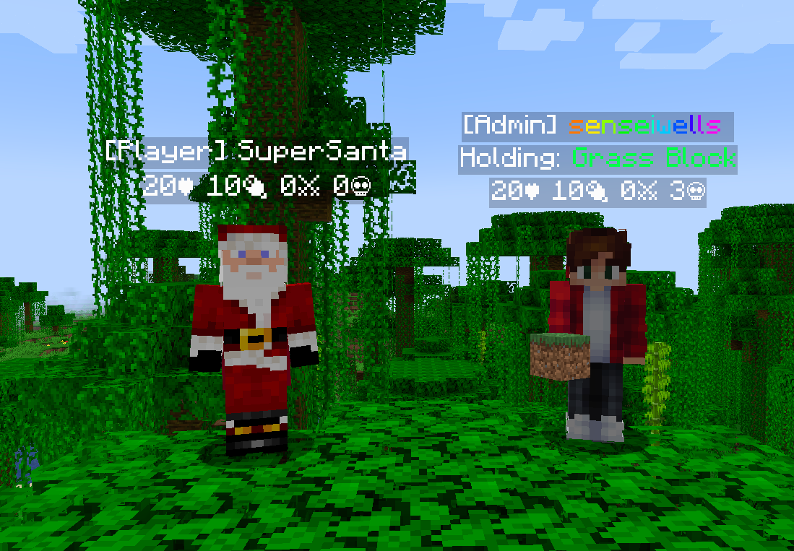

#  CustomNameTags

This mod provides you with a way to customize your player's
name tags completely server-side with no need for any client mods.



## Commands

You are able to do some basic actions from within the game with the `/nametag`
command, this requires permission level 2 or if you are using a permissions mod
you can have the permission `"customnametags.command.nametag"`.

#### `/nametag create <identifier> <text>`
This creates a nametag with a given identifier and text, this supports the
[placeholder api](https://placeholders.pb4.eu/user/default-placeholders/).

#### `/nametag delete <identifier>`
This deletes a given nametag with identifier.

#### `/nametag reload`
This reloads the config file.

## Configuration

This mod allows a high level of customization, from the text being
displayed, whether it is being displayed and who it can be displayed to.

All of this is configured using a json located in `config/CustomNameTags/config.json`.
The above image used the following configuration:

```json
{
  "name_tags": [
    {
      "id": "example:admin_name",
      "update_interval": -1,
      "literal": "[Admin] <rainbow>%player:displayname_visual%<rainbow> ",
      "observee_predicate": {
        "type": "operator",
        "operator": 4
      }
    },
    {
      "id": "example:name",
      "update_interval": -1,
      "literal": "[Player] %player:displayname_visual%",
      "observee_predicate": {
        "type": "negate",
        "value": {
          "type": "operator",
          "operator": 4
        }
      }
    },
    {
      "id": "example:held_item",
      "update_interval": 1,
      "literal": "Holding: <green>%player:equipment_slot mainhand%</green>",
      "observee_predicate": {
        "type": "negate",
        "value": {
          "type": "entity",
          "value": {
            "equipment": {
              "mainhand": {
                "items": [
                  "minecraft:air"
                ]
              }
            }
          }
        }
      }
    },
    {
      "id": "example:data",
      "update_interval": 1,
      "literal": "%player:health%♥ %player:hunger%🍖 %player:statistic minecraft:killed minecraft:player%⚔ %player:statistic minecraft:deaths%\uD83D\uDC80"
    }
  ]
}
```

### Creating a Nametag

In the config json, there will be an array which contains all the nametags
that will be displayed for your players. Each nametag is its own object.

Let's have a look at what makes up a nametag:

#### `"id"`
This is the identifier unique to your nametag, and follows this convention:
`"namespace:name"`.

#### `"update_interval"`
This is the interval at which the nametag will be updated, in ticks. 
Set to -1 if your nametag doesn't need to be updated.

#### `"literal"`
This is the text that will be displayed on your nametag. This supports 
the [placeholder api](https://placeholders.pb4.eu/user/default-placeholders/),
which means you can add contextual data. 

For example `"%player:displayname"` which will insert the display name of the current player. 
For all the details reference the [placeholder api](https://placeholders.pb4.eu/user/default-placeholders/).

#### `"observee_predicate"`
This is optional and doesn't need to be defined, but if defined will allow
you to decide which players will have this given nametag. 

For example, in the example, above only operators are given the `"example:admin_name"` 
nametag and only non-operators are given the `"example:name"` nametag.

This uses the [predicate api](https://github.com/Patbox/PredicateAPI/blob/1.20.2/BUILTIN.md);
you can view the documentation for more details about what predicates you
can define.

#### `"observer_predicate"`
This is optional and doesn't need to be defined, but if defined will determine 
whether an observing player will be able to see this nametag.

This uses the [predicate api](https://github.com/Patbox/PredicateAPI/blob/1.20.2/BUILTIN.md);
you can view the documentation for more details about what predicates you
can define.

# Caveats

There are some limitations of CustomNameTags, while for almost all the cases
the nametags will behave as expected, there are inconsistencies with the
custom nametags.

- When players press F1 to hide their HUD player custom nametags will remain visible.
- If the player is part of a team, their normal nametag will render.
  - This can be solved by hiding all nametags for the given team:
  - `/team modify <team> nametagVisibility never`